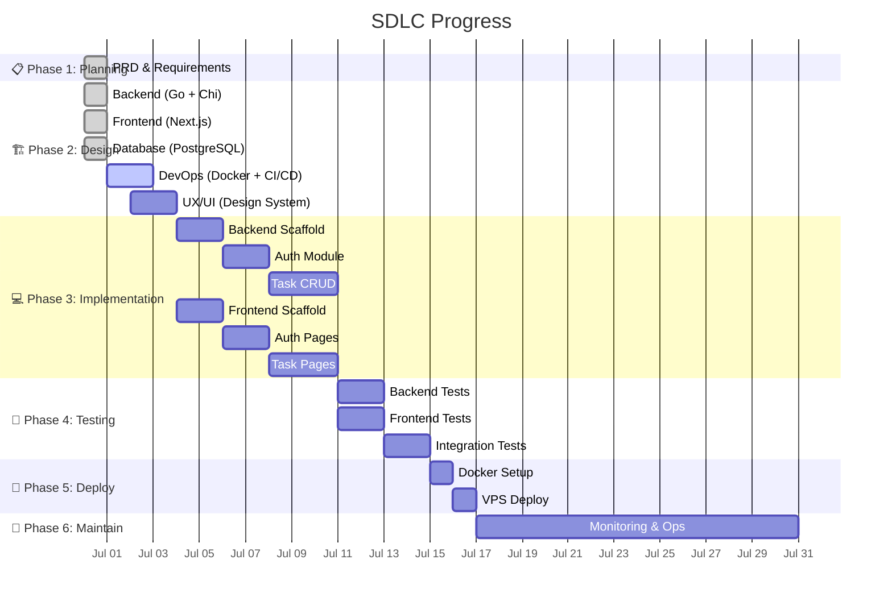
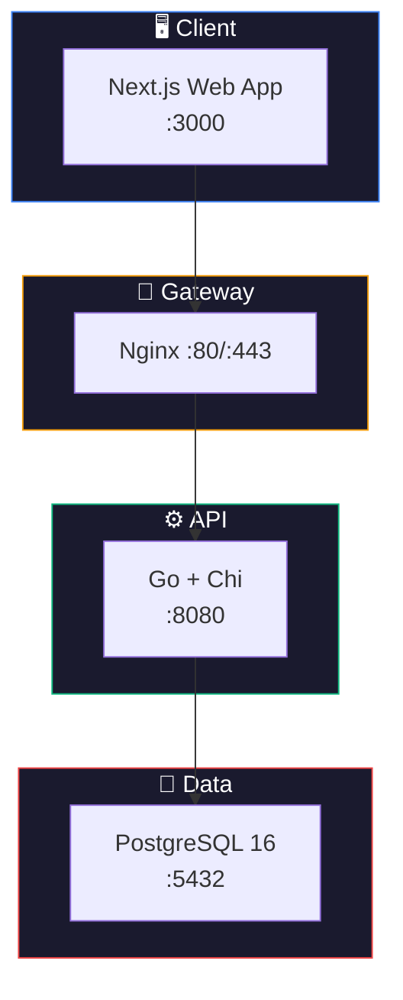

# 🚀 Hermes TodoList

> **Production-grade todo list app** — Full SDLC · Team 5-20 users · SaaS-ready architecture

<p align="center">

[](https://github.com/DangDDT/hermes-todolist/actions/workflows/ci.yml)
[](https://github.com/DangDDT/hermes-todolist/actions/workflows/deploy.yml)
[](https://go.dev)
[](https://nextjs.org)
[](https://www.postgresql.org)
[](https://docker.com)
[](LICENSE)

</p>

---

## 📊 Project Dashboard

| Dashboard | Link |
|-----------|------|
| 🗂️ **Issues** | [View All](https://github.com/DangDDT/hermes-todolist/issues) |
| 🏷️ **Labels** | [Filter by label](https://github.com/DangDDT/hermes-todolist/labels) |
| 🎯 **Milestones** | [MVP v1.0](https://github.com/DangDDT/hermes-todolist/milestone/1) · [P1](https://github.com/DangDDT/hermes-todolist/milestone/2) · [P2](https://github.com/DangDDT/hermes-todolist/milestone/3) · [P3](https://github.com/DangDDT/hermes-todolist/milestone/4) · [P4](https://github.com/DangDDT/hermes-todolist/milestone/5) |
| 🔄 **CI/CD** | [Actions](https://github.com/DangDDT/hermes-todolist/actions) |
| 📚 **Wiki** | [Documentation Hub](https://github.com/DangDDT/hermes-todolist/wiki) |
| 🛡️ **Security** | [Security Advisories](https://github.com/DangDDT/hermes-todolist/security) |
| 📈 **Insights** | [Pulse](https://github.com/DangDDT/hermes-todolist/pulse) · [Contributors](https://github.com/DangDDT/hermes-todolist/graphs/contributors) |

---

## 🎯 MVP v1.0 Progress



---

## 🏗️ Architecture



👉 [Full Architecture Docs](https://github.com/DangDDT/hermes-todolist/wiki/Architecture)

---

## 🛠️ Tech Stack

| Layer | Stack |
|-------|-------|
| **Frontend** | Next.js 15 (App Router) · shadcn/ui · TanStack Query v5 · Tailwind v4 · react-hook-form + zod |
| **Backend** | Go 1.23+ · Chi v5 · sqlc · golang-migrate · swaggo/swag · slog · caarlos0/env |
| **Database** | PostgreSQL 16 · UUID PK · Soft Delete · Partial Indexes |
| **DevOps** | Docker Compose · GitHub Actions · Nginx · GHCR |

👉 [Full Tech Stack Docs](https://github.com/DangDDT/hermes-todolist/wiki/Tech-Stack)

---

## 📋 MVP Features

- [x] Project documentation & planning
- [ ] User authentication (username + password)
- [ ] Task CRUD (title, description, due date, priority, tags, assignee, status)
- [ ] Task list with filtering, sorting, pagination
- [ ] Responsive web UI with dark mode
- [ ] REST API with Swagger docs
- [ ] Docker Compose deployment
- [ ] CI/CD pipeline
- [ ] Unit + integration tests

👉 [Full PRD](https://github.com/DangDDT/hermes-todolist/wiki/PRD) · [Backlog (34 items)](https://github.com/DangDDT/hermes-todolist/wiki/Backlog)

---

## 🏃 Quick Start

```bash
# Clone
git clone https://github.com/DangDDT/hermes-todolist.git
cd hermes-todolist

# Start all services
docker compose up -d

# API at http://localhost:8080
# Swagger at http://localhost:8080/swagger/
# Web at http://localhost:3000
```

---

## 📂 Project Structure

```
hermes-todolist/
├── .github/
│   ├── workflows/
│   │   ├── ci.yml              # Lint + Test on push/PR
│   │   └── deploy.yml          # Build Docker + Deploy to VPS
│   └── dependabot.yml          # Auto dependency updates
├── backend/                    # Go API
│   ├── cmd/server/main.go
│   ├── internal/
│   │   ├── config/
│   │   ├── domain/             # DDD Entities
│   │   ├── feature/            # Feature-first handlers
│   │   ├── infra/              # PostgreSQL, middleware
│   │   └── shared/             # Errors, response, pagination
│   ├── Dockerfile
│   └── Makefile
├── frontend/                   # Next.js web app
│   ├── src/
│   │   ├── app/                # App Router pages
│   │   ├── components/         # Shared UI (shadcn/ui)
│   │   ├── features/           # Feature modules
│   │   └── lib/                # API client, utils
│   ├── Dockerfile
│   └── package.json
├── docs/                       # Documentation (mirrors wiki)
├── docker-compose.yml
└── README.md                   # 👈 You are here
```

---

## 🧑‍💻 Author

**DangDDT** — Full Stack Developer  
*Built with the guidance of **Tada** (Hermes Agent) — full SDLC methodology*

---

<p align="center">
  <sub>Phase 2 · System Design · Last updated: 2026-06-30</sub>
</p>
