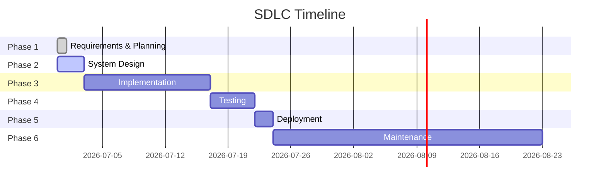

# Hermes TodoList — Documentation Hub

> **Source of Truth** cho toàn bộ dự án — theo chuẩn SDLC.
> Toàn bộ tài liệu nằm trong repo, version-controlled, Mermaid diagrams render trực tiếp trên GitHub.

---

## 📚 Mục Lục

| Tài liệu | Nội dung | Status |
|----------|---------|--------|
| [PRD](prd.md) | Product Requirements Document — đặc tả yêu cầu MVP | ✅ Approved |
| [Architecture](architecture.md) | Kiến trúc hệ thống — Mermaid diagrams | ✅ Approved |
| [Tech Stack](tech-stack.md) | Toàn bộ công nghệ đã chốt từng layer | ✅ Approved |
| [API Spec](api-spec.md) | REST API endpoints & contracts | ✅ Approved |
| [Backlog](backlog.md) | Tính năng tương lai + technical debt | ✅ Approved |
| [Database Schema](database-schema.md) | PostgreSQL schema + migrations | 🔄 In Progress |

---

## 🎯 Quick Facts

| Item | Value |
|------|-------|
| **Repo** | [DangDDT/hermes-todolist](https://github.com/DangDDT/hermes-todolist) |
| **Owner** | DangDDT |
| **Status** | MVP Development |
| **SDLC Phase** | Phase 2 — System Design |
| **Target Users** | 5-20 (team internal) |

---

## 🔄 SDLC Progress

---

*Last updated: 2026-06-30 by Tada (Hermes Agent)*
