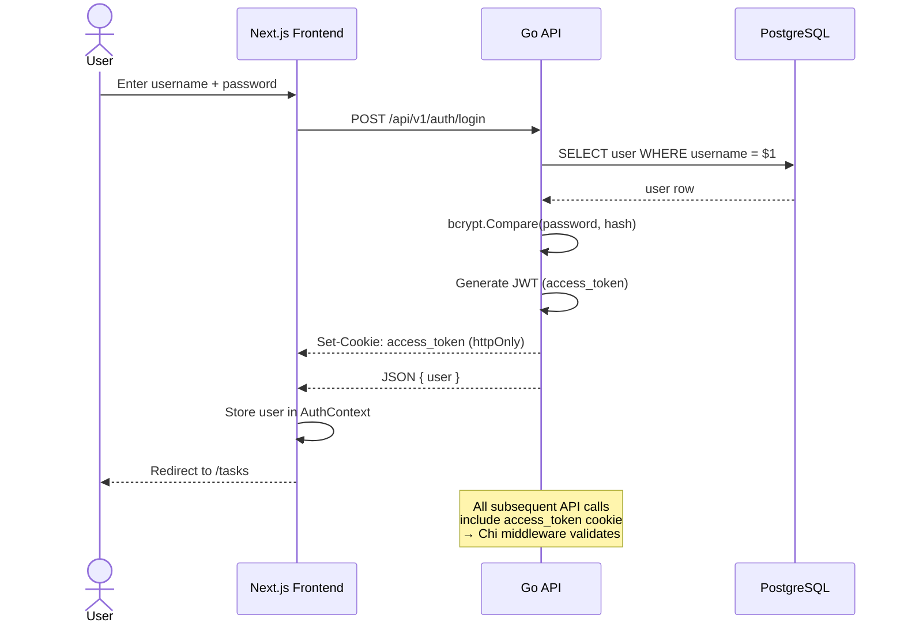

# API Specification

> REST API v1 — OpenAPI 3.0 / Swagger (auto-generated by swaggo/swag)

---

## Base URL

```
Development: http://localhost:8080/api/v1
Production:  https://<domain>/api/v1
```

---

## Authentication

### `POST /auth/register`

Register new user.

**Request:**
```json
{
  "username": "dangddt",
  "password": "securePass123",
  "display_name": "Dang DDT"
}
```

**Response** `201 Created`:
```json
{
  "data": {
    "id": "550e8400-e29b-41d4-a716-446655440000",
    "username": "dangddt",
    "display_name": "Dang DDT",
    "created_at": "2026-06-30T00:00:00Z"
  }
}
```

| Status | Code | Description |
|--------|------|-------------|
| 201 | — | Created |
| 400 | VALIDATION_ERROR | Invalid input |
| 409 | USERNAME_TAKEN | Username already exists |

---

### `POST /auth/login`

Login and receive JWT cookie.

**Request:**
```json
{
  "username": "dangddt",
  "password": "securePass123"
}
```

**Response** `200 OK` — `Set-Cookie: access_token=<JWT>; HttpOnly; Secure; SameSite=Strict`:
```json
{
  "data": {
    "user": {
      "id": "550e8400-e29b-41d4-a716-446655440000",
      "username": "dangddt",
      "display_name": "Dang DDT"
    },
    "expires_at": "2026-07-07T00:00:00Z"
  }
}
```

| Status | Code | Description |
|--------|------|-------------|
| 200 | — | Success |
| 400 | VALIDATION_ERROR | Invalid input |
| 401 | INVALID_CREDENTIALS | Wrong username/password |

---

### `POST /auth/refresh`

Refresh expired access token.

**Response** `200 OK`: Same as login, new cookie set.

| Status | Code | Description |
|--------|------|-------------|
| 200 | — | New token issued |
| 401 | UNAUTHORIZED | Invalid/expired refresh token |

---

### `POST /auth/logout`

Clear JWT cookie.

**Response** `200 OK`:
```json
{ "data": null }
```

---

## Tasks

> **All task endpoints require authentication** (`Cookie: access_token=<JWT>`)

### `GET /tasks`

List tasks with filters.

**Query Parameters:**

| Param | Type | Required | Default | Description |
|-------|------|----------|---------|-------------|
| `status` | task_status | No | — | `TODO`, `IN_PROGRESS`, `DONE`, `CANCELLED` |
| `assignee_id` | UUID | No | — | Filter by assignee |
| `tag` | string | No | — | Filter by tag name (exact match) |
| `priority` | task_priority | No | — | `LOW`, `MEDIUM`, `HIGH`, `URGENT` |
| `sort_by` | string | No | `created_at` | `due_date`, `priority`, `created_at` |
| `order` | string | No | `desc` | `asc`, `desc` |
| `page` | int | No | `1` | Page number (1-indexed) |
| `per_page` | int | No | `20` | Items per page (max 100) |

**Response** `200 OK`:
```json
{
  "data": [
    {
      "id": "550e8400-e29b-41d4-a716-446655440000",
      "title": "Fix login bug",
      "description": "Users cannot login with special characters",
      "status": "IN_PROGRESS",
      "priority": "HIGH",
      "due_date": "2026-07-15T00:00:00Z",
      "creator": {
        "id": "550e8400-e29b-41d4-a716-446655440001",
        "display_name": "Dang DDT"
      },
      "assignee": {
        "id": "550e8400-e29b-41d4-a716-446655440001",
        "display_name": "Dang DDT"
      },
      "tags": [
        { "id": 1, "name": "bug", "color": "#EF4444" }
      ],
      "created_at": "2026-06-30T00:00:00Z",
      "updated_at": "2026-06-30T00:00:00Z"
    }
  ],
  "meta": {
    "page": 1,
    "per_page": 20,
    "total": 150
  }
}
```

---

### `POST /tasks`

Create new task.

**Request:**
```json
{
  "title": "Fix login bug",
  "description": "Users cannot login with special characters in password",
  "priority": "HIGH",
  "due_date": "2026-07-15T00:00:00Z",
  "assignee_id": "550e8400-e29b-41d4-a716-446655440001",
  "tag_ids": [1, 4]
}
```

| Field | Required | Notes |
|-------|----------|-------|
| `title` | ✅ | Max 255 chars |
| `description` | ❌ | Default: "" |
| `priority` | ❌ | Default: `MEDIUM` |
| `due_date` | ❌ | ISO 8601, nullable |
| `assignee_id` | ❌ | Must be valid user UUID |
| `tag_ids` | ❌ | Array of tag IDs (must exist) |

**Response** `201 Created`: Full task object (same shape as GET /tasks/{id})

| Status | Code | Description |
|--------|------|-------------|
| 201 | — | Created |
| 400 | VALIDATION_ERROR | Invalid input |

---

### `GET /tasks/{id}`

Get single task by ID.

**Response** `200 OK`: Full task object

| Status | Code | Description |
|--------|------|-------------|
| 200 | — | Success |
| 404 | TASK_NOT_FOUND | Task doesn't exist or deleted |

---

### `PATCH /tasks/{id}`

Partial update task. All fields optional — only send what you want to change.

**Request:**
```json
{
  "title": "Updated title",
  "status": "DONE",
  "priority": "LOW",
  "assignee_id": "550e8400-e29b-41d4-a716-446655440002"
}
```

**Response** `200 OK`: Updated full task object

| Status | Code | Description |
|--------|------|-------------|
| 200 | — | Updated |
| 400 | VALIDATION_ERROR | Invalid input |
| 404 | TASK_NOT_FOUND | Not found |

---

### `DELETE /tasks/{id}`

Soft delete task (sets `deleted_at`).

**Response** `200 OK`:
```json
{ "data": null }
```

---

## Tags

### `GET /tags`

List all available tags (no auth required).

**Response** `200 OK`:
```json
{
  "data": [
    { "id": 1, "name": "bug", "color": "#EF4444" },
    { "id": 2, "name": "feature", "color": "#3B82F6" },
    { "id": 3, "name": "improvement", "color": "#10B981" },
    { "id": 4, "name": "documentation", "color": "#F59E0B" },
    { "id": 5, "name": "urgent", "color": "#8B5CF6" },
    { "id": 6, "name": "design", "color": "#EC4899" }
  ]
}
```

---

## Health

### `GET /health`

Health check — no auth required.

**Response** `200 OK`:
```json
{
  "status": "ok",
  "timestamp": "2026-06-30T00:00:00Z",
  "version": "1.0.0",
  "uptime_seconds": 3600
}
```

---

## Error Format

All errors follow this structure:

```json
{
  "error": {
    "code": "ERROR_CODE",
    "message": "Human-readable message",
    "details": {}
  }
}
```

### Error Codes Reference

| HTTP | Code | Description |
|------|------|-------------|
| 400 | VALIDATION_ERROR | Request validation failed |
| 401 | UNAUTHORIZED | Missing/invalid JWT token |
| 401 | INVALID_CREDENTIALS | Wrong username or password |
| 401 | TOKEN_EXPIRED | JWT token has expired |
| 403 | FORBIDDEN | Not allowed to perform action |
| 404 | NOT_FOUND | Generic resource not found |
| 404 | TASK_NOT_FOUND | Task doesn't exist or deleted |
| 409 | USERNAME_TAKEN | Username already registered |
| 429 | RATE_LIMITED | Too many requests |
| 500 | INTERNAL_ERROR | Unexpected server error |

---

## Auth Flow



---

*Approved: 2026-06-30*
