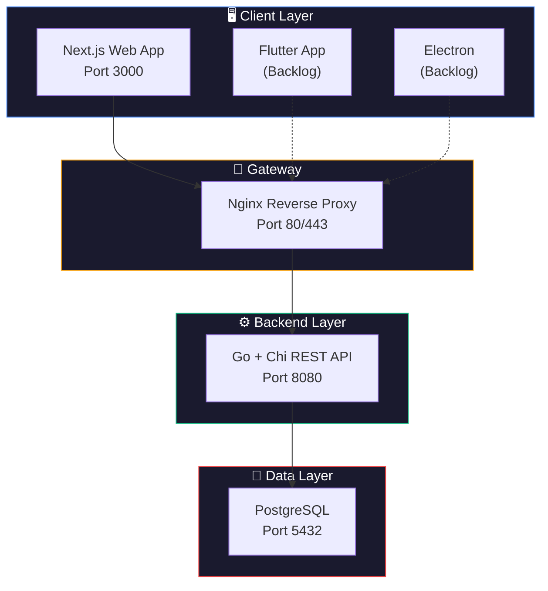
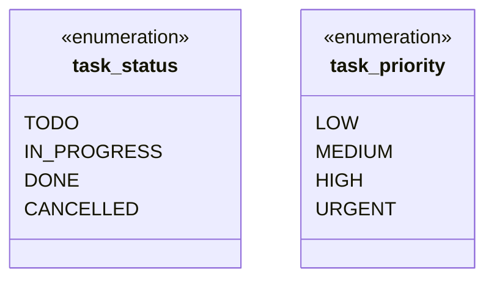
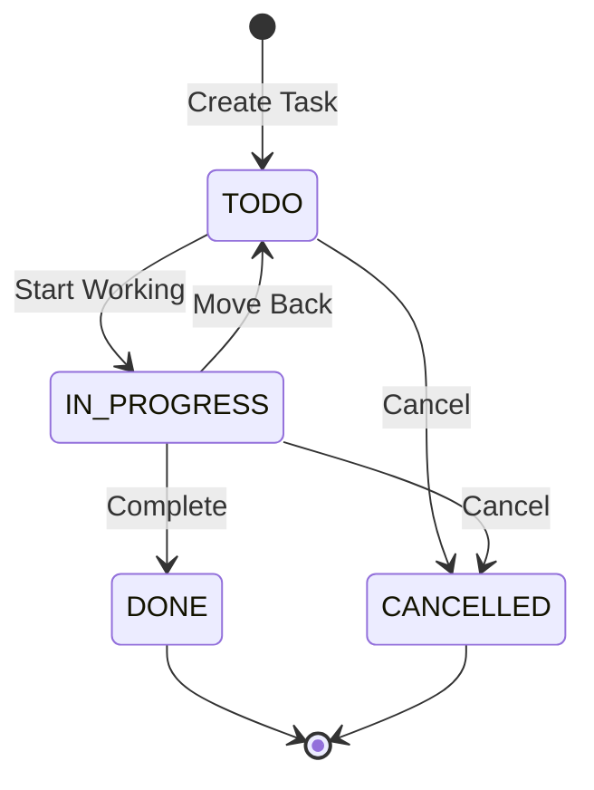
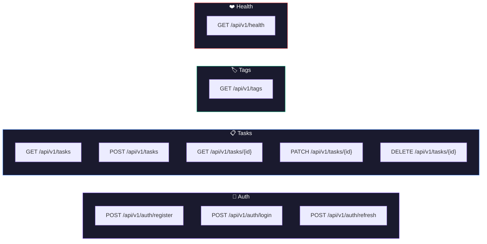
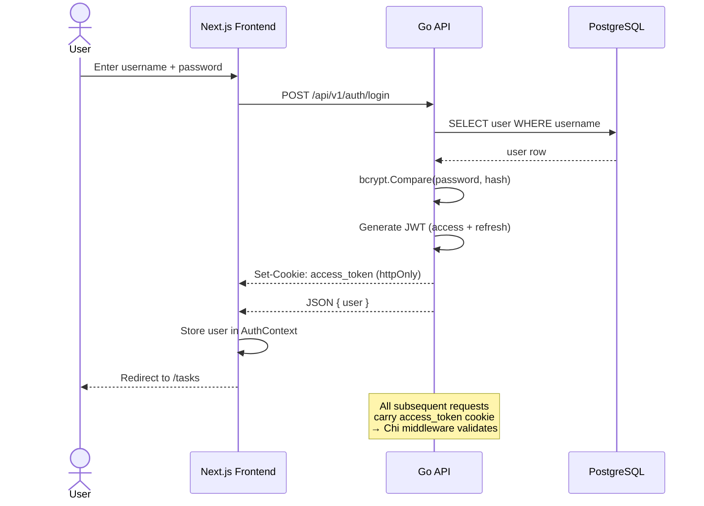
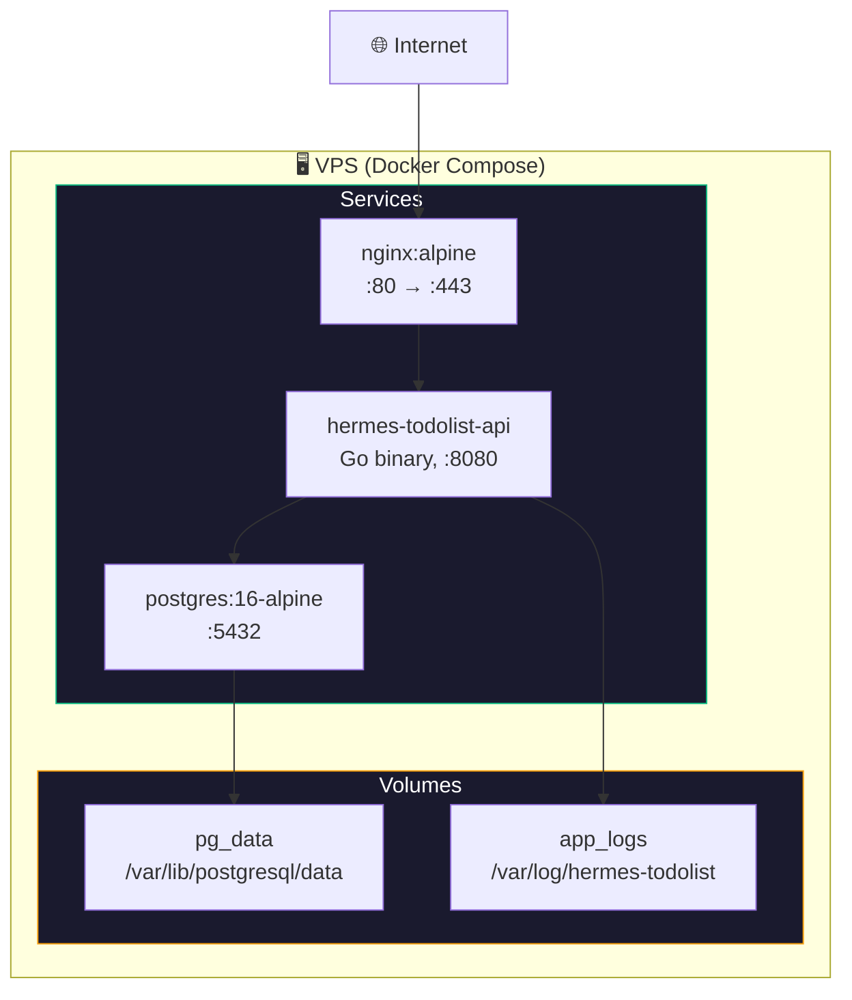

# Architecture Document

## v1.0 — MVP

**Product:** Hermes TodoList  
**Date:** 2026-06-30  
**Status:** Draft  

---

## 1. System Architecture Overview



---

## 2. Database ERD

```mermaid
erDiagram
    users {
        uuid id PK "uuid_generate_v4()"
        varchar username UK "50 chars"
        varchar password_hash "255 chars"
        varchar display_name "100 chars"
        timestamptz created_at
        timestamptz updated_at
    }

    tasks {
        uuid id PK "uuid_generate_v4()"
        varchar title "255 chars"
        text description
        task_status status "ENUM: TODO, IN_PROGRESS, DONE, CANCELLED"
        task_priority priority "ENUM: LOW, MEDIUM, HIGH, URGENT"
        timestamptz due_date "nullable"
        uuid creator_id FK "NOT NULL → users.id"
        uuid assignee_id FK "nullable → users.id"
        timestamptz created_at
        timestamptz updated_at
        timestamptz deleted_at "soft delete"
    }

    tags {
        serial id PK
        varchar name UK "50 chars"
        varchar color "hex, 7 chars"
    }

    task_tags {
        uuid task_id PK_FK "→ tasks.id CASCADE"
        int tag_id PK_FK "→ tags.id CASCADE"
    }

    users ||--o{ tasks : "creator_id"
    users ||--o{ tasks : "assignee_id"
    tasks ||--o{ task_tags : "task_id"
    tags ||--o{ task_tags : "tag_id"
```

### Index Map

| Index Name | Table | Columns | Condition |
|-----------|-------|---------|-----------|
| `idx_tasks_creator` | tasks | creator_id | `WHERE deleted_at IS NULL` |
| `idx_tasks_assignee` | tasks | assignee_id | `WHERE deleted_at IS NULL` |
| `idx_tasks_status` | tasks | status | `WHERE deleted_at IS NULL` |
| `idx_tasks_due_date` | tasks | due_date | `WHERE deleted_at IS NULL` |
| `idx_tasks_deleted` | tasks | deleted_at | — |
| `idx_task_tags_task` | task_tags | task_id | — |
| `idx_users_username` | users | username | — |

### ENUM Types



### State Machine: Task Lifecycle



---

## 3. API Design



### API Response Format

```json
// Success
{
  "data": { ... },
  "meta": {
    "page": 1,
    "per_page": 20,
    "total": 150
  }
}

// Error
{
  "error": {
    "code": "TASK_NOT_FOUND",
    "message": "Task with id xxx not found",
    "details": {}
  }
}
```

### Auth Flow



---

## 4. Docker Deployment



---

## 5. CI/CD Pipeline

```mermaid
graph LR
    Push["📤 Git Push"] --> Lint["🧹 Lint<br/>golangci-lint + ESLint"]
    Lint --> Test["🧪 Test<br/>go test + vitest"]
    Test --> Build["📦 Build<br/>Go binary + Next.js export"]
    Build --> Docker["🐳 Docker<br/>Build + Push image"]
    Docker --> Deploy["🚀 Deploy<br/>SSH → VPS pull + restart"]

    style Push fill:#1a1a2e,stroke:#6b7280,color:#fff
    style Lint fill:#1a1a2e,stroke:#f59e0b,color:#fff
    style Test fill:#1a1a2e,stroke:#3b82f6,color:#fff
    style Build fill:#1a1a2e,stroke:#8b5cf6,color:#fff
    style Docker fill:#1a1a2e,stroke:#10b981,color:#fff
    style Deploy fill:#1a1a2e,stroke:#ef4444,color:#fff
```



---

## 6. Tech Stack Summary

| Layer | Technology | Purpose |
|-------|-----------|---------|
| Web | Next.js 15 (App Router) | React framework, SSR/SSG |
| Mobile | Flutter (backlog) | Cross-platform mobile |
| Desktop | Electron (backlog) | Desktop app |
| Backend | Go + Chi v5 | REST API |
| Auth | JWT (httpOnly cookie) | Stateless auth |
| DB | PostgreSQL 16 | Relational data |
| ORM/Query | sqlc | Type-safe SQL codegen |
| Migration | golang-migrate | DB version control |
| Validation | go-playground/validator | Input validation |
| Logging | slog (stdlib) | Structured logging |
| Config | caarlos0/env | 12-factor config |
| API Docs | swaggo/swag | OpenAPI/Swagger |
| UI | shadcn/ui + Tailwind v4 | Component system |
| State | TanStack Query v5 | Server state |
| Forms | react-hook-form + zod | Form management |
| Testing FE | Vitest + RTL + Playwright | Unit/Comp/E2E |
| Testing BE | go test + testify | Unit/Integration |
| CI/CD | GitHub Actions | Automation |
| Deploy | Docker Compose + VPS | Container orchestration |
| Reverse Proxy | Nginx | SSL, routing |
| Monitoring | slog + Sentry + health endpoint | Observability |

---

*Document maintained by Tada as part of SDLC Phase 2.*
