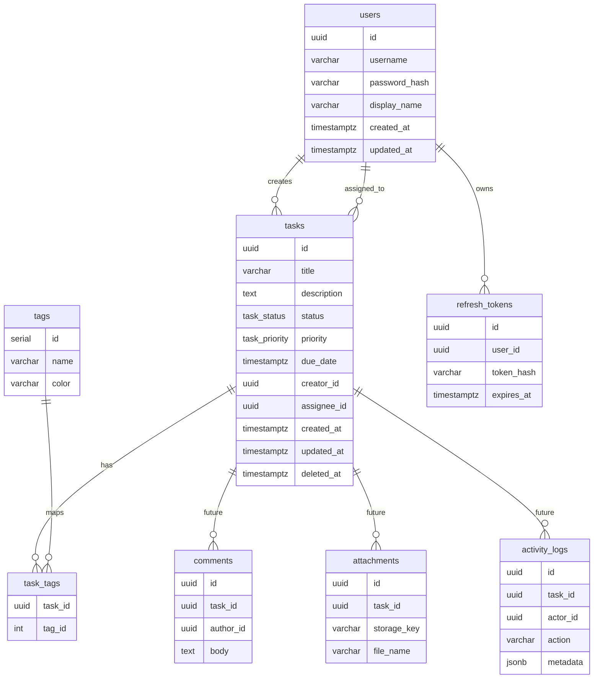

# Database Diagrams

## 1. MVP + Future-Ready ERD

---

## 2. Data Ownership Notes
- `creator_id`: ai tạo task
- `assignee_id`: ai chịu trách nhiệm làm task
- `deleted_at`: soft delete boundary
- `refresh_tokens`: hỗ trợ auth hardening roadmap
- `comments`, `attachments`, `activity_logs`: future-ready entities, chưa thuộc MVP build scope
