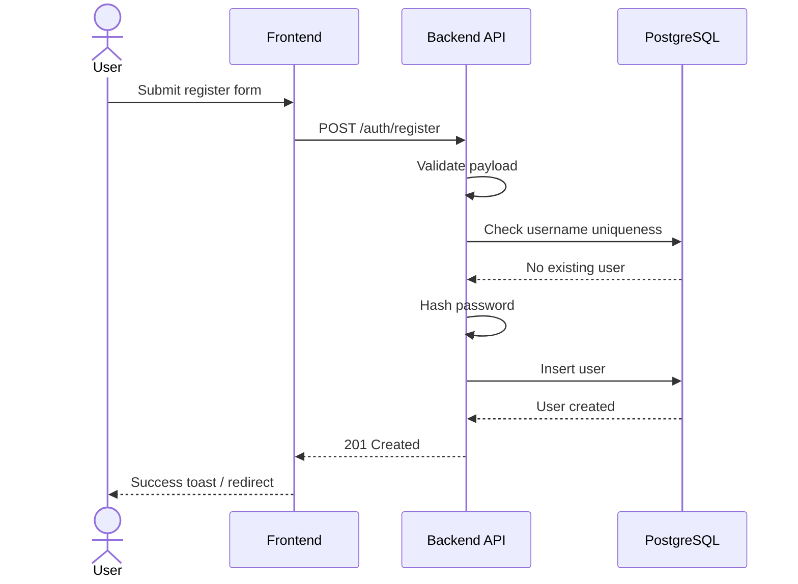
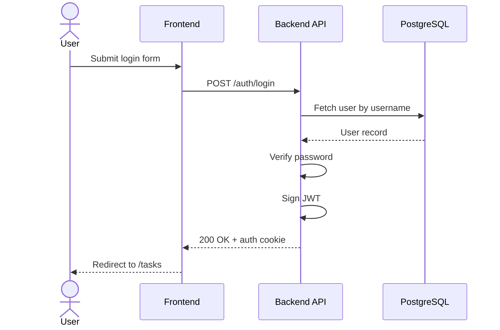
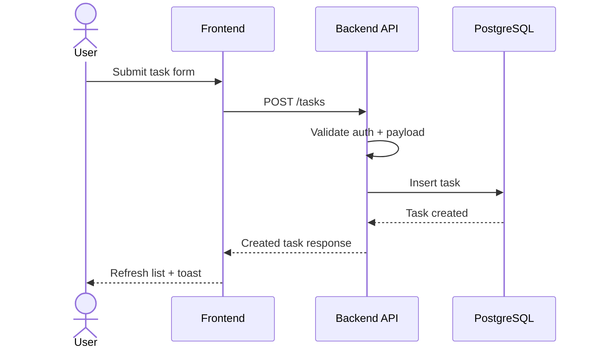
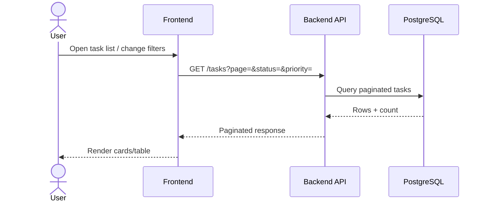

# Sequence Diagrams

## 1. Register Flow

```mermaid
sequenceDiagram
    actor User
    participant FE as Frontend
    participant API as Backend API
    participant DB as PostgreSQL

    User->>FE: Submit register form
    FE->>API: POST /auth/register
    API->>API: Validate payload
    API->>DB: Check username uniqueness
    DB-->>API: No existing user
    API->>API: Hash password
    API->>DB: Insert user
    DB-->>API: User created
    API-->>FE: 201 Created
    FE-->>User: Success toast / redirect
```

## 2. Login Flow

```mermaid
sequenceDiagram
    actor User
    participant FE as Frontend
    participant API as Backend API
    participant DB as PostgreSQL

    User->>FE: Submit login form
    FE->>API: POST /auth/login
    API->>DB: Fetch user by username
    DB-->>API: User record
    API->>API: Verify password
    API->>API: Sign JWT
    API-->>FE: 200 OK + auth cookie
    FE-->>User: Redirect to /tasks
```

## 3. Create Task Flow

```mermaid
sequenceDiagram
    actor User
    participant FE as Frontend
    participant API as Backend API
    participant DB as PostgreSQL

    User->>FE: Submit task form
    FE->>API: POST /tasks
    API->>API: Validate auth + payload
    API->>DB: Insert task
    DB-->>API: Task created
    API-->>FE: Created task response
    FE-->>User: Refresh list + toast
```

## 4. List Task Flow

```mermaid
sequenceDiagram
    actor User
    participant FE as Frontend
    participant API as Backend API
    participant DB as PostgreSQL

    User->>FE: Open task list / change filters
    FE->>API: GET /tasks?page=&status=&priority=
    API->>DB: Query paginated tasks
    DB-->>API: Rows + count
    API-->>FE: Paginated response
    FE-->>User: Render cards/table
```
