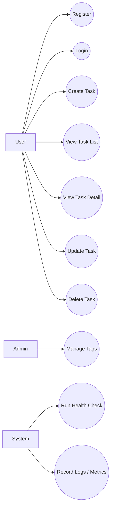

# Use Cases

## 1. Actors
- User: authenticated team member
- Admin: elevated user / system manager
- System: backend platform, scheduled jobs, observability services

---

## 2. Use Case Diagram

---

## 3. Use Case Details
### UC-01 Register
- Primary Actor: User
- Preconditions: user not authenticated
- Trigger: user opens register form and submits
- Main Flow:
  1. User enters username, display name, password.
  2. System validates payload.
  3. System checks username uniqueness.
  4. System hashes password.
  5. System creates user record.
  6. System returns success response.
- Alternate Flow:
  - Username already exists → conflict response.
  - Invalid password → validation error.
- Postconditions: account exists.

### UC-02 Login
- Primary Actor: User
- Preconditions: account exists
- Main Flow:
  1. User submits credentials.
  2. System verifies password.
  3. System issues JWT / session cookie.
  4. User becomes authenticated.
- Alternate Flow:
  - Invalid credentials → unauthorized.

### UC-03 Create Task
- Primary Actor: User
- Preconditions: authenticated
- Main Flow:
  1. User fills task form.
  2. System validates fields.
  3. System persists task.
  4. System returns created task.
- Postconditions: task exists and appears in list.

### UC-04 View Task List
- Primary Actor: User
- Preconditions: authenticated
- Main Flow:
  1. User opens task list.
  2. System returns paginated tasks.
  3. User applies filters/sort.
  4. System returns refined result set.

### UC-05 View Task Detail
- Primary Actor: User
- Preconditions: authenticated, task exists
- Main Flow:
  1. User opens task detail page.
  2. System returns task by id.

### UC-06 Update Task
- Primary Actor: User
- Preconditions: authenticated, task exists
- Main Flow:
  1. User edits fields.
  2. System validates and saves.
  3. System returns updated task.

### UC-07 Delete Task
- Primary Actor: User
- Preconditions: authenticated, task exists
- Main Flow:
  1. User confirms delete.
  2. System soft deletes task.
  3. Task disappears from active list.

### UC-08 Health / Logging
- Primary Actor: System
- Main Flow:
  1. Health endpoint is invoked.
  2. System returns service status.
  3. Logs are emitted for request lifecycle.
